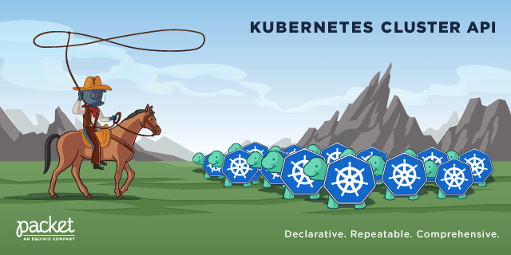

# Equinix Metal cluster-api Provider

[](https://github.com/kubernetes-sigs/cluster-api-provider-packet/releases)
[](https://github.com/kubernetes-sigs/cluster-api-provider-packet/actions/workflows/ci.yaml)
[](https://pkg.go.dev/sigs.k8s.io/cluster-api-provider-packet?tab=overview)
[](https://goreportcard.com/report/sigs.k8s.io/cluster-api-provider-packet)
[](https://hub.docker.com/r/packethost/cluster-api-provider-packet/)

This is the official [cluster-api](https://github.com/kubernetes-sigs/cluster-api) provider for [Equinix Metal](https://metal.equinix.com/), formerly known as Packet. It implements cluster-api provider version v1beta1.



## Requirements

To use the cluster-api to deploy a Kubernetes cluster to Equinix Metal, you need the following:

* A Equinix Metal API key
* A Equinix Metal project ID
* The `clusterctl` binary from the [official cluster-api provider releases page](https://github.com/kubernetes-sigs/cluster-api/releases)
* A Kubernetes cluster - the "bootstrap cluster" - that will deploy and manage the cluster on Equinix Metal.
* `kubectl` - not absolutely required, but it is hard to interact with a cluster without it!

For the bootstrap cluster, any compliant cluster will work, including
[official kubernetes](https://kubernetes.io), [k3s](https://k3s.io), [kind](https://github.com/kubernetes-sigs/kind)
and [k3d](https://github.com/rancher/k3d).

Once you have your cluster, ensure your `KUBECONFIG` environment variable is set correctly.

## Getting Started

You should then follow the [Cluster API Quick Start Guide](https://cluster-api.sigs.k8s.io/user/quick-start.html), selecting the 'Equinix Metal' tabs where offered.

### Defaults

If you do not change the generated `yaml` files, it will use defaults. You can look in the [templates/cluster-template.yaml](./templates/cluster-template.yaml) file for details.

* `CPEM_VERSION`                 (defaults to `v3.5.0`)
* `KUBE_VIP_VERSION`             (defaults to `v0.5.0`)
* `NODE_OS`                      (defaults to `ubuntu_22_04`)
* `POD_CIDR`                     (defaults to `192.168.0.0/16`)
* `SERVICE_CIDR`                 (defaults to `172.26.0.0/16`)
  
### Reserved Hardware

If you'd like to use reserved instances for your cluster, you need to edit your cluster yaml and add a hardwareReservationID field to your PacketMachineTemplates. That field can contain either a comma-separated list of hardware reservation IDs you'd like to use (which will cause it to ignore the facility and machineType you've specified), or just "next-available" to let the controller pick one that's available (that matches the machineType and facility you've specified). Here's an example:

```yaml
apiVersion: infrastructure.cluster.x-k8s.io/v1beta1
kind: PacketMachineTemplate
metadata:
  name: my-cluster-control-plane
  namespace: default
spec:
  template:
    spec:
      billingCycle: hourly
      machineType: c3.small.x86
      os: ubuntu_22_04
      sshKeys:
      - ssh-ed25519 AAAAC3NzaC1lZDI1NTE5AAAAIDvMgVEubPLztrvVKgNPnRe9sZSjAqaYj9nmCkgr4PdK username@computer
      tags: []
      #If you want to specify the exact machines to use, provide a comma separated list of UUIDs
      hardwareReservationID: "b537c5aa-2ef3-11ed-a261-0242ac120002,b537c5aa-2ef3-11ed-a261-0242ac120002"
      #Or let the controller pick from available reserved hardware in the project that matches machineType and facility with `next-available`
      #hardwareReservationID: "next-available"
```

## Community, discussion, contribution, and support

Learn how to engage with the Kubernetes community on the [community page](http://kubernetes.io/community/).

Equinix has a [cluster-api guide](https://metal.equinix.com/developers/guides/kubernetes-cluster-api/)

You can reach the maintainers of this project at:

* Chat with us on [Slack](http://slack.k8s.io/) in the [#cluster-api-provider-packet](https://kubernetes.slack.com/archives/C8TSNPY4T) channel
* Subscribe to the [SIG Cluster Lifecycle](https://groups.google.com/forum/#!forum/kubernetes-sig-cluster-lifecycle) Google Group for access to documents and calendars

## Development and Customizations

The following section describes how to use the cluster-api provider for packet (CAPP) as a regular user.
You do _not_ need to clone this repository, or install any special tools, other than the standard
`kubectl` and `clusterctl`; see below.

* To build CAPP and to deploy individual components, see [docs/BUILD.md](./docs/BUILD.md).
* To build CAPP and to cut a proper release, see [docs/RELEASE.md](./docs/RELEASE.md).

## Code of conduct

Participation in the Kubernetes community is governed by the [Kubernetes Code of Conduct](code-of-conduct.md).
