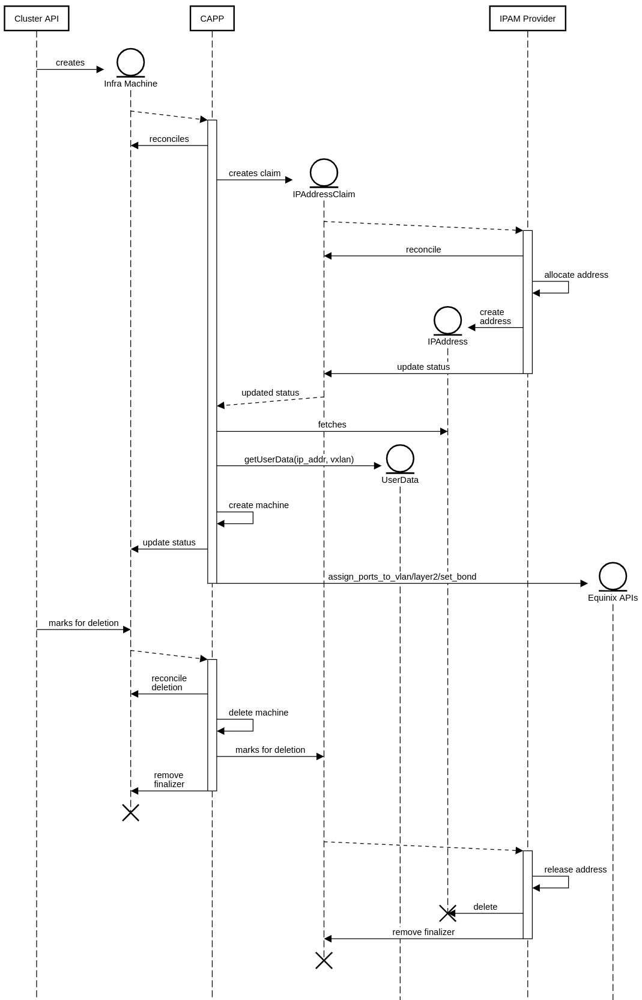

# CAPP Layer 2 And IPAM Support

Motivation/Abstract
===================

By default all servers that are created on Equinix Metal via Cluster API have Layer 3 networking and there is no option when provisioning Equinix Metal cluster to specify type of networking for instances or to create additional L2 interfaces with specific local IP addresses and VLAN.

To solve this, CAPP should provide options to specify:

-   Network type (L2/L3/Hybrid)

-   Creating network interfaces with specific VLAN

-   IP address range for L2 interfaces

-   IP Address Management (IPAM) support

* * * * *

Limitations
===========

- The current limitation is that CAPP-managed clusters running in a full Layer 2 (L2) environment would need to pull images from a repository within the same network or use a bastion host acting as a gateway with NAT. 
- However, this isn't supported at this stage. While users can define their own image storage and routing solutions within the L2 network, it's important to note that interactions with Equinix Metal APIs (including accessing metadata for user-data scripts during node startup) are critical for ClusterAPI and CPEM functionality. 
- We're intentionally keeping full Layer 2 ideation and solutions out of scope for now to focus on the networking modes that enable L2 features while still preserving the default L3 public addressing capabilities.

* * * * *

Goals
===============

In Phase 1 of integrating Layer2 support, the Cluster API Provider Packet (CAPP) will focus on Bring Your Own (BYO) Infrastructure,which allows users to have greater control and flexibility over the infrastructure and network configurations.

Key objectives for this phase include:
- Implementing Hybrid Bonded Mode and Hybrid Unbonded Modes to enhance Layer2 functionalities in CAPP.
- Enabling CAPP to attach network ports to specific VLANs or VXLANs.
- Allowing CAPP to configure Layer2 networking at the OS level on a metal node, including creating sub-interfaces, assigning IP addresses, and assigning VLANs.
- Implementing support for the IPAM API contract in CAPP.
- Allow dynamically allocating and releasing addresses


Non-Goals/ Future Work
===============

- Support for Layer 2 networking in a full Layer 2 (L2) environment.
- Handling updates to the networks on `PacketMachine` objects
- Handling updates to the `addressesFromPools` list on individual networks.
- User direct manipulation of `IPAddressClaim's`
- IP Address Management – this is the job of the IPAM provider
- Support for specific IPs for specific machines - a machine will receive a random IP in the pool. Implementation of this feature can be left to future work.


Proposal Design/Approach
========================

* * * * *

**Understanding the context and problem space** : 
- The problem space primarily revolves around the operating system (OS) and, to some extent, the cluster level. Specifically, it concerns how Cluster API (CAPP) clusters and machines are defined by IP addresses, networks, and gateways.
- A critical aspect of this space is how CAPP provisions infrastructure, particularly network infrastructure. This includes VLANs, gateways, VRFs, etc.
- Additionally, it involves the management of VRFs and the attachment of these network resources to nodes, ensuring that newly created nodes have ports in a ready state for these attachments. 
- The default approach will be Layer2 networking in a hybrid-bonded mode, though other configurations may also be supported in the future.
- This understanding forms the foundation for addressing the technical challenges in provisioning and managing network infrastructure with CAPP.
 
**Bring Your Own Infrastructure (BYOI)**:

- The BYOI approach allows users to leverage their existing infrastructure, such as VLANs, VRFs, Metal Gateways, and similar components.
- In this model, users specify the IP ranges to be assigned to metal nodes on VLAN-tagged interfaces. Importantly, CAPP is not responsible for creating or managing this infrastructure, it is assumed to already exist.
- However, CAPP needs to be informed of the VLAN ID to attach the network port to the appropriate VLAN using the Equinix Metal (EM) API. This ensures that the network configuration aligns with the pre-existing infrastructure provided by the user.


### Implementation Details/Notes/Constraints

#### API Changes

PacketCluster and PacketMachine will be extended to support the new network configurations for Layer2 networking.

##### PacketCluster
PacketCluster will have a new field called **Networks**, which will be a list of NetworkSpec objects. NetworkSpec objects define different networks that can be attached to the PacketCluster. Each NetworkSpec object will have the following fields:
- Name: Name of the network, e.g., "storage VLAN" (optional)
- Description: Description of the network, e.g., "Storage network for VMs" (optional)
- IPAddresses: IP address range for the cluster network, e.g, Virtual Routing and Forwarding (VRF) . This field will be a list of strings, where each string represents an IP address range.
- Assignment: Component responsible for allocating IP addresses to the machines, either cluster-api or dhcp or some other component.

```go
type PacketClusterSpec struct {
  ...
    // Networks is a list of network configurations for the PacketCluster
    Networks []NetworkSpec `json:"networks,omitempty"`
}

// +kubebuilder:validation:Enum=cluster-api,dhcp
type AssignmentType string

const (
    AssignmentClusterAPI AssignmentType = "cluster-api"
    AssignmentDHCP       AssignmentType = "dhcp"
)

// NetworkSpec defines the network configuration for a PacketCluster
type NetworkSpec struct {
    // Name of the network, e.g. "storage VLAN", is optional
    // +optional
    Name        string         `json:"name,omitempty"`
    // Description of the network, e.g. "Storage network", is optional
    // +optional
    Description string         `json:"description,omitempty"`
    // IpAddressRange for the cluster network for eg: VRF IP Ranges
    IPAddresses []string      `json:"ipAddresses,omitempty"`
    // Assignment is component responsible for allocating IP addresses to the machines, either cluster-api or dhcp
    Assignment  AssignmentType `json:"assignment,omitempty"`
}
```

The following example configures a network named "storage VLAN" with VRF address range 192.168.0.0/16. The IP addresses are assigned to the indvidual machines by the cluster-api component.

```yaml
kind: PacketCluster
metadata:
  name: example-packet-cluster
spec:
  template:
    spec:
      facility: ny5
      metro: ny
      plan: c3.small.x86
      billingCycle: hourly
      project: your-packet-project-id
      sshKeys:
        - ssh-rsa AAAAB3...your-public-key...
      operatingSystem: ubuntu_20_04
      networks:
        - name: Storage VLAN
          description: Storage network for VMs
          ipAddresses: ["10.60.0.0/16"]
          assignment: cluster-api
```

##### PacketMachine

To support enhanced layer2 networking capabilities, we propose adding a new Ports field under the spec of the *PacketMachine*. These fields will allow users to define various network port configurations and add static routes for an Equinix Metal Machine. Below is an outline of the proposed changes:

```go
// Port defines the Layer2(VLAN) Configuration that needs to be done on a port (eg: bond0).
type Port struct {
	// name of the port e.g bond0,eth0 and eth1 for 2 NIC servers.
	Name string `json:"name"`
	// port bonded or not.
	Bonded bool `json:"bonded,omitempty"`
	// convert port to layer 2. is false by default on new devices. changes result in /ports/id/convert/layer-[2|3] API calls
	Layer2 bool `json:"layer2,omitempty"`
	// Network configurations for the port
	Networks []Network `json:"networks"`
}

// Network defines the network configuration for a port.
type Network struct {
	// VLANs for EM API to find by vxlan, project, and metro match then attach to device. OS userdata template will also configure this VLAN on the bond device
	VXLAN int `json:"vxlan,omitempty"`
	// VLAN ID for the VLAN created on the EM Console
	VLANID string `json:"vlanID,omitempty"`
	// Netmask is the netmask for the network.
	// eg: 255.255.255.248
	Netmask string `json:"netmask,omitempty"`
	// AddressFromPool is a reference of IPAddressPool that should be assigned to IPAddressClaim.
	// The machine's cloud-init metadata will be populated with IPAddresse fulfilled by an IPAM provider.
	AddressFromPool corev1.TypedLocalObjectReference `json:"addressFromPool,omitempty"`
	// AddressType is the type of address to assign to the machine. It can be either Internal or External.
	// kubebuilder:validation:Enum=Internal;External
	AddressType corev1.NodeAddressType `json:"addressType,omitempty"`
	// List of Routes to be configured on the Packet Machine
	// +optional
	Routes []*RouteSpec `json:"routes,omitempty"`
}

// RouteSpec defines the static route configuration for a PacketMachine.
type RouteSpec struct {
	Destination string `json:"destination"`
	Gateway     string `json:"gateway"`
}
```

Following the contract specified by the IPAM integration proposal we plan to:

- Add the `addressesFromPools` field to the `networks` section of
  the `PacketMachine` and `PacketMachineTemplate` CRDs. The
  `addressesFromPools` field will allow a user to specify that the network
  device's IP address should be claimed from an IP pool.
- If a `PacketMachine` has been specified to claim an IP address from an
  IP pool, then CAPP will create an `IPAddressClaim`, which the IPAM provider
  will use to allocate an `IPAddress`. This `IPAddress` can then be used by the
  `PacketMachine`.


### User Stories

#### Story 1
As a user, I want to be able to create a `PacketMachine` with a Layer 2 network configuration that includes a specific VXLAN, IP addresses , and static routes.

#### Story 2

As a user, I want to be able to create a `PacketMachine` where the IP address
for the metal node/port/vlan comes from an IPAM Provider instead of from DHCP.

#### Story 3

As a user I want to be able to allocate either IPv4 addresses for my
`PacketMachine`.

#### Story 4

As a user I want to be able to release my IP address allocation when the
`PacketMachine` is deleted for future `PacketMachine`s to use.

****

##### Example Configurations

```yaml
kind: PacketMachineTemplate
metadata:
  name: controlplane-packet-machine-template
spec:
  template:
    spec:
      facility: ny5
      metro: ny
      plan: c3.small.x86
      billingCycle: hourly
      project: your-packet-project-id
      sshKeys:
        - ssh-rsa AAAAB3...your-public-key...
      operatingSystem: ubuntu_20_04
      ports:
        - name: bond0
          layer2: false
          networks:
          - vxlan: 1000
            vlanID: f4ad3be2-9284-4dc3-bdb6-8d120064f921
            addressType: "Internal"
            routes:
            - destination: 192.168.0.0/16
              gateway: 192.168.10.1
            addressFromPool:
              apiGroup: ipam.cluster.x-k8s.io
              kind: InClusterIPPool
              name: inclusterippool-sample

kind: PacketMachineTemplate
metadata:
  name: worker-packet-machine-template-1
spec:
  template:
    spec:
      facility: ny5
      metro: ny
      plan: c3.small.x86
      billingCycle: hourly
      project: your-packet-project-id
      sshKeys:
        - ssh-rsa AAAAB3...your-public-key...
      operatingSystem: ubuntu_20_04
      ports:
        - name: bond0
          layer2: false
          networks:
          - vxlan: 1000
            vlanID: f4ad3be2-9284-4dc3-bdb6-8d120064f921	
            addressType: "Internal"
            routes:
            - destination: 192.168.0.0/16
              gateway: 192.168.10.1
            addressFromPool:
              apiGroup: ipam.cluster.x-k8s.io
              kind: InClusterIPPool
              name: inclusterippool-sample
```

### APIs:

* * * * *

Following are some of the APIs provided by EM, that would be used:
1. **Convert the port to a layer2 port**:

    a. https://deploy.equinix.com/developers/api/metal/#tag/Ports/operation/convertLayer2
    b. Endpoint: https://api.equinix.com/metal/v1/ports/{id}/convert/layer-2
    c. Requied Params : vnid (VLAN ID) 

2. **Assign a port to a virtual network (VLAN)**:

    a. https://deploy.equinix.com/developers/api/metal/#tag/Ports/operation/assignPort

    b. Endpoint: https://api.equinix.com/metal/v1/ports/{id}/assign
Requied Params : vnid (VLAN ID)
	c. Type: POST
    d. Batch Mode
    ```
    curl -X POST \
    -H "Content-Type: application/json" \
    -H "X-Auth-Token: <API_TOKEN> " \
    "https://api.equinix.com/metal/v1/ports/{id}/vlan-assignments/batches" \
    -d '{
        "vlan_assignments": [
            {
                "vlan": "string",
                "state": "assigned"
            },
            {
                "vlan": "string",
                "state": "assigned"
            },
        ]
    }'
    ```

3. **Device Events API**:
 	a. Endpoint:  `https://api.equinix.com/metal/v1/devices/<id>/events`

4. **Remove port from the bond**
    a. Endpoint: 
    ```
    curl -X POST \
        -H "Content-Type: application/json" \
        -H "X-Auth-Token: <API_TOKEN>" \
        "https://api.equinix.com/metal/v1/ports/{id}/disbond" \
        -d '{
            "bulk_disable": false
        }'
    ```

### User-Data Script for Network Configuration
To configure the operating system (OS), create new sub-interfaces for handling VLAN-tagged traffic, and assign IP addresses to those sub-interfaces, a user-data script is required to run at the time of OS boot.
Below is the user-data script that would be used.

```sh
#cloud-config

package_update: true
package_upgrade: true
packages:
  - jq
  - vlan

write_files:
  - path: /var/lib/capi_network_settings/final_configuration.sh
    permissions: '0755'
    content: |
      #!/bin/bash
      set -euo pipefail

      echo "Running final configuration commands"
      apt-get update -qq
      apt-get install -y -qq jq vlan

      modprobe 8021q
      echo "8021q" >> /etc/modules

      # Generate the network configuration and append it to /etc/network/interfaces for each VLAN-tagged sub-interface.
      cat <<EOL >> /etc/network/interfaces
{{ range .VLANs }}
      auto {{ .PortName }}.{{ .Vxlan }}
      iface {{ .PortName }}.{{ .Vxlan }} inet static
        pre-up sleep 5
        address {{ .IPAddress }}
        netmask {{ .Netmask }}
      {{- if .Gateway }}
        gateway {{ .Gateway }}
      {{- end }}
        vlan-raw-device {{ .PortName }}
      {{- range .Routes }}
        up ip route add {{ .Destination }} via {{ .Gateway }}
      {{- end }}
{{ end }}
      EOL

      echo "VLAN configuration appended to /etc/network/interfaces."

      # Function to send user state events
      url="$(curl -sf https://metadata.platformequinix.com/metadata | jq -r .user_state_url)"

      # Function to send user state events
      send_user_state_event() {
          local state="$1"
          local code="$2"
          local message="$3"
          local data
          local max_retries=3
          local retry_count=0
          
          data=$(jq -n --arg state "$state" --arg code "$code" --arg message "$message" \
                '{state: $state, code: ($code | tonumber), message: $message}')

          while [ $retry_count -lt $max_retries ]; do
              # Make the POST request and capture the HTTP status code
              http_code=$(curl -s -o /dev/null -w "%{http_code}" -X POST -d "$data" "$url")

              echo "HTTP Status Code: $http_code"

              if [[ "$http_code" -ge 200 && "$http_code" -lt 300 ]]; then
                  echo "User state event sent successfully on attempt $((retry_count + 1))"
                  return 0
              else
                  echo "Warning: Received non-success status code: $http_code"
              fi

              retry_count=$((retry_count + 1))
              if [ $retry_count -lt $max_retries ]; then
                  echo "Retrying in 5 seconds..."
                  sleep 5
              fi
          done

          echo "Error: Failed to send user state event after $max_retries attempts"
          return 1
      }


      send_user_state_event running 1000 "network_configuration_started"

      # Restart networking to apply VLAN configurations
      echo "Restarting networking service..."
      systemctl restart networking

      # Wait for interfaces to be fully up
      echo "Waiting for interfaces to be up..."
      sleep 5

      # Verify network configuration
      verification_failed=false
{{ range .VLANs }}
      if ip addr show {{ .PortName }}.{{ .Vxlan }} | grep -q {{ .IPAddress }}; then
        echo "Configuration for VLAN {{ .Vxlan }} on {{ .PortName }} with IP {{ .IPAddress }} successful"
      else
        echo "Configuration for VLAN {{ .Vxlan }} on {{ .PortName }} with IP {{ .IPAddress }} failed" >&2
        verification_failed=true
      fi

      # Verify static routes
{{ range .Routes }}
      if ip route | grep -q "{{ .Destination }} via {{ .Gateway }}"; then
        echo "Static route to {{ .Destination }} via {{ .Gateway }} added successfully"
      else
        echo "Failed to add static route to {{ .Destination }} via {{ .Gateway }}" >&2
        verification_failed=true
      fi
{{ end }}
{{ end }}

      if [ "$verification_failed" = true ]; then
        send_user_state_event failed 1002 "network_configuration_failed"
        exit 1
      else
        send_user_state_event succeeded 1001 "network_configuration_success"
      fi
    
  - path: /var/lib/capi_network_settings/initial_configuration.sh
    permissions: '0755'
    content: |
      #!/bin/bash
      set -eu
      
      # Fetch metadata from Equinix Metal
      metadata=$(curl https://metadata.platformequinix.com/metadata)
      
      # Extract MAC addresses for eth0 and eth1
      mac_eth0=$(echo "$metadata" | jq -r '.network.interfaces[] | select(.name == "eth0") | .mac')
      mac_eth1=$(echo "$metadata" | jq -r '.network.interfaces[] | select(.name == "eth1") | .mac')
      
      # Check if MAC addresses were successfully extracted
      if [ -z "$mac_eth0" ] || [ -z "$mac_eth1" ]; then
        echo "Error: Failed to extract MAC addresses" >&2
        exit 1
      fi
      
      # Display extracted MAC addresses
      echo "Extracted MAC addresses - eth0: $mac_eth0, eth1: $mac_eth1"
      
      # Function to find network interface by MAC address
      find_interface_by_mac() {
        local mac="$1"
        for iface in $(ls /sys/class/net/); do
          iface_mac=$(ethtool -P "$iface" 2>/dev/null | awk '{print $NF}')
          if [ "$iface_mac" == "$mac" ]; then
            echo "$iface"
            return
          fi
        done
        echo "Interface not found for MAC $mac" >&2
        return 1
      }
      
      # Find interfaces for eth0 and eth1 MAC addresses
      iface_eth0=$(find_interface_by_mac "$mac_eth0")
      iface_eth1=$(find_interface_by_mac "$mac_eth1")
      
      # Check and replace eth0 in /var/lib/capi_network_settings/final_configuration.sh
      if grep -q "eth0" /var/lib/capi_network_settings/final_configuration.sh; then
        sed -i "s/eth0/${iface_eth0}/g" /var/lib/capi_network_settings/final_configuration.sh
        echo "Replaced eth0 with ${iface_eth0} in /var/lib/capi_network_settings/final_configuration.sh"
      else
        echo "No occurrences of eth0 found in /var/lib/capi_network_settings/final_configuration.sh. No changes made."
      fi
      
      # Check and replace eth1 in /var/lib/capi_network_settings/final_configuration.sh
      if grep -q "eth1" /var/lib/capi_network_settings/final_configuration.sh; then
        sed -i "s/eth1/${iface_eth1}/g" /var/lib/capi_network_settings/final_configuration.sh
        echo "Replaced eth1 with ${iface_eth1} in /var/lib/capi_network_settings/final_configuration.sh"
      else
        echo "No occurrences of eth1 found in /var/lib/capi_network_settings/final_configuration.sh. No changes made."
      fi

runcmd:
  - /var/lib/capi_network_settings/initial_configuration.sh
  - /var/lib/capi_network_settings/final_configuration.sh
```

The CAPP will use go-templates to substitute the placeholders with appropriate values given by the user.

#### PacketMachine Controller Changes

- The PacketMachine controller will be updated to handle the new fields in the PacketMachine and PacketMachineTemplate CRDs. The controller will be responsible for creating the network configurations for the PacketMachine and ensuring that the user-data script is generated correctly with the required network configurations.
- The controller will also be responsible for updating the necessary network configurations on the Equinix Metal side using the EM API.

#### IPAM Integration
1. If the `addressesFromPools` field is set on a network then this controller
   will create a new `IPAddressClaim` for each pool configured on the network.
   This `IPAddressClaim` will be created in the same namespace as the
`PacketMachine` / `PacketMachineTemplate`. The `IPAddressClaim`
   will be named according to the device index and the pool index in the
   `PacketMachine` spec. The controller will not continue the metal node creation process
   until all `IPAddressClaim`s have been fulfilled.

    ```yaml
    apiVersion: ipam.cluster.x-k8s.io/v1beta1
    kind: IPAddressClaim
    metadata:
        finalizers:
        - packetmachine.infrastructure.cluster.x-k8s.io/ip-claim-protection
        name: capi-quickstart-control-plane-qd4mq-port-0-network-0
        namespace: default
    ownerReferences:
    - apiVersion: infrastructure.cluster.x-k8s.io/v1beta1
        kind: PacketMachine
        name: capi-quickstart-control-plane-qd4mq
        uid: 3e4c1115-1d6a-4b12-8082-f8eac13f69d0
    spec:
    poolRef:
        apiGroup: ipam.cluster.x-k8s.io
        kind: InClusterIPPool
        name: inclusterippool-sample
    status:
        addressRef: null
    ```

1. It will set the `PacketMachine` Status to reflect that an `IPAddressClaim`(s)
   has been created and that it is waiting for an `IPAddress`(es) to be bound
   to the claim(s). The Status should include information on how many addresses
   are bound out of how many are requested:

    ```yaml
    status:
      conditions:
        - lastTransitionTime: "2022-09-14T14:00:00Z"
          type: IPAddressClaimed
          status: "False"
          reason: "WaitingForIPAddress"
          message: "Waiting for IPAddressClaim to have an IPAddress bound."
    ```

1. The controller would watch `IPAddressClaim`s. When an `IPAddress` is bound
   to the claim it can continue the reconciliation of the `PacketMachine`.

    ```yaml
    apiVersion: ipam.cluster.x-k8s.io/v1beta1
    kind: IPAddressClaim
    metadata:
        finalizers:
        - packetmachine.infrastructure.cluster.x-k8s.io/ip-claim-protection
        name: capi-quickstart-control-plane-qd4mq-port-0-network-0
        namespace: default
    ownerReferences:
    - apiVersion: infrastructure.cluster.x-k8s.io/v1beta1
        kind: PacketMachine
        name: capi-quickstart-control-plane-qd4mq
        uid: 3e4c1115-1d6a-4b12-8082-f8eac13f69d0
    spec:
    poolRef:
        apiGroup: ipam.cluster.x-k8s.io
        kind: InClusterIPPool
        name: inclusterippool-sample
    status:
        addressRef: capi-quickstart-control-plane-qd4mq-port-0-network-0
    ---
    apiVersion: ipam.cluster.x-k8s.io/v1beta1
    kind: IPAddress
    metadata:
        finalizers:
        - ipam.cluster.x-k8s.io/ProtectAddress
        
        name: capi-quickstart-control-plane-qd4mq-port-0-network-0
        namespace: default
        ownerReferences:
        - apiVersion: ipam.cluster.x-k8s.io/v1beta1
            blockOwnerDeletion: true
            controller: true
            kind: IPAddressClaim
            name: capi-quickstart-control-plane-qd4mq-port-0-network-0
            uid: b3b44e70-d83b-449b-b7fa-adfb112bf96b
        - apiVersion: ipam.cluster.x-k8s.io/v1alpha2
            blockOwnerDeletion: true
            controller: false
            kind: InClusterIPPool
            name: inclusterippool-sample
            uid: f6f25df5-87cc-4a4f-9e25-708c1230953e
        resourceVersion: "207923"
    spec:
        address: 192.168.10.2
        claimRef:
            name: capi-quickstart-control-plane-qd4mq-port-0-network-0
        gateway: 192.168.10.1
        poolRef:
            apiGroup: ipam.cluster.x-k8s.io
            kind: InClusterIPPool
            name: inclusterippool-sample
        prefix: 24
    ```

1. The controller can continue the packet machine creation process once all
   `IPAddressClaim`s have been bound. It will read the `IPAddressClaim` status
   for the bound `IPAddress` to be passed into the VM metadata. The metadata
   template will need to be updated to accept this IP address(es) and populate
   the addresses field with the IPs for the corresponding device.

   The device index on the `IPAddressClaim` name will be used to configure the
   IP address on the correct device.

1. Update the `PacketMachine` status to reflect the Claim Status. Update
   the `IPAddressClaim` condition.

    ```yaml
    ---
    status:
      conditions:
        - lastTransitionTime: "2022-09-14T14:00:00Z"
          type: IPAddressClaimed
          status: "True"
    ```

See the following picture for a sequence diagram of the allocation process.




#### Owner Reference and Finalizer

When a `IPAddressClaim` is created, a finalizer named
`ipam.cluster.x-k8s.io/ip-claim-protection` will be added, as well as an owner
reference linking back to the `PacketMachine`.

The finalizer will prevent users from deleting `IPAddressClaim`s that are in-use
by VMs.

During `PacketNachine` delete reconcilliation, after the machine is deleted from the
EM API, the `IPAddressClaim`'s finalizer will be removed. When the
`PacketMachine` is deleted in the Kubernetes API, the garbage collector will delete
the referencing `IPAddressClaim`s. When the pachine is deleted from the Equinix Metal
API, it is safe to release the IP for use on another machine.

### Note:
1. If you want to connect the VLANs that are in different metros, you need to enable [Backend Transfer](https://deploy.equinix.com/developers/docs/metal/networking/backend-transfer/)

2. If you want to use your own IP address range, and the VLANs are in the same metro, you can use the VRF Metal Gateway to connect the VLANs and allow CAPP to assign IP addresses from the specified range.

3. The VXLAN tagged sub-interfaces are created on machines first and the IP addresses are assigned to them and after that, the VLANs are assigned to the ports using the EM API. This is because we don't have port ID information until the machine is created and since we user user-data script to create the sub-interfaces, we need to run the script during the machine is created.

#### Validation

### Security Model
- Following the original IPAM integration proposal, the `IPAddressClaim`,
  `IPAddress`, and IP pool are required to be in the same namespace as the
  `PacketMachine`.
- For `IPAddressClaim` and `IPAddress` this is enforced by the lack of a
  namespace field on the reference
- The `addressesFromPools` field on the
  `PacketMachineTemplate`/`PacketMachine` also lacks a namespace field on
  the reference.

### Risks and Mitigations
- Unresponsive IPAM providers can prevent successful creation of a cluster
- Any issues with fulfilling the IPAddressClaim can prevent successful creation of a cluster
  - This is partially by design i.e we don't want the cluster to be created if
    it can't fulfill the ip address claim, but this is just added complexity
    that a user has to be aware of.
- Wrong IP address allocations (e.g. duplicates) can brick a cluster’s network
- Incorrectly assigning IP address claims to the wrong device
  - We assume the devices and pools in the PacketMachine spec are static. If a user
    decides to change the spec at runtime, this will cause undefined behavior.
- A user could cause an IP address to be allocated to another machine/device
  while in use by deleting the IPAddressClaim.
  - This can be mitigated by adding a finalizer similar to the
    `kubernetes.io/pvc-protection` finalizer.

- The user-data script for network configuration is not idempotent. If the
  script causes errors, the machine will be in error state.

- The user-data script fails to signal the controller if the network
  configuration failed/passed. This can cause the controller to assume the machine is
  in a good state when it is not. 

## Alternatives

Continuing to use some DHCP based solution, but DHCP has proven to have many
limitations (see motivation) that users want to avoid.

Considering the IPAM integration proposal has been accepted we didn't consider
any alternative approaches to IPAM outside of what has been defined by the
proposal.

## Additional Details

### Test Plan

Note: Section not required until targeted at a release.

### Graduation Criteria

Note: Section not required until targeted at a release.

### Version Skew Strategy


## References

[Cluster API IPAM Provider In Cluster](https://github.com/telekom/cluster-api-ipam-provider-in-cluster)
[IPAM integration proposal](https://github.com/kubernetes-sigs/cluster-api/blob/main/docs/proposals/20220125-ipam-integration.md)
[Historical implementation of static IP support for CAPV using M3](https://github.com/spectrocloud/cluster-api-provider-vsphere-static-ip)

## Implementation History
